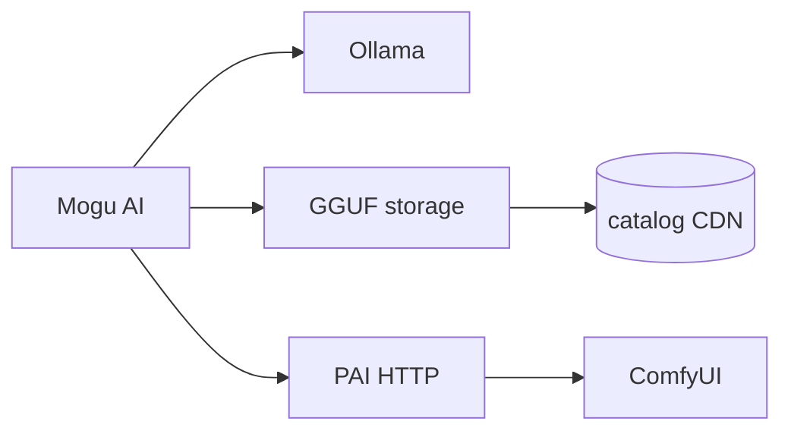

# Mogu AI · 蘑菇AI

**English** | [简体中文](./README.zh-CN.md)

<p align="center">
  <strong>Download local AI models · Chat offline · Optional ComfyUI rendering</strong><br/>
  <sub>One Windows desktop app — no terminal, your data stays on your PC.</sub>
</p>

[](https://github.com/ly136148277-netizen/mogu-ai-releases/releases/latest)
[](LICENSE)
[](https://github.com/ly136148277-netizen/MoguAI)
[](#for-developers)

---

## What is Mogu AI?

**Mogu AI** is a free, open-source desktop app for people who want **local AI** without juggling five different tools.

| You want to… | Mogu AI helps by… |
|--------------|-------------------|
| Try Llama, Qwen, Phi, etc. | Browsing a curated **GGUF model store** with one-click download |
| Chat without cloud APIs | Built-in **Ollama chat** — multi-session, Markdown, export |
| Skip `ollama create` | **Auto-import** after download |
| Render with ComfyUI *(optional)* | **Workflow panel** — drop JSON, refresh, run presets via PAI butler |

Everything runs on your machine. After models are downloaded, chat works **fully offline**.

---

## Screenshots & download

**Windows installers (recommended):**

👉 **[Download latest release](https://github.com/ly136148277-netizen/mogu-ai-releases/releases/latest)**

| File | Description |
|------|-------------|
| `蘑菇AI Setup x.y.z.exe` | Installer (recommended) |
| `蘑菇AI x.y.z.exe` | Portable, no install |

**Requirements:** [Ollama](https://ollama.com/) for chat · [PAI](https://github.com/) *(optional)* for butler & ComfyUI features

---

## Quick start — chat in 3 steps

```
Install Ollama → Download a model in Mogu AI → Start chatting
```

1. Install **[Ollama](https://ollama.com/)** and make sure it is running.
2. Open **Model store** → pick a model (e.g. Qwen 2.5 7B) → **Download**.
3. When import finishes, open **AI Chat** and send a message.

No command line. No Modelfile editing.

---

## ComfyUI workflows — where do JSON files go?

> **Full guide:** [`docs/COMFYUI_WORKFLOWS.md`](./docs/COMFYUI_WORKFLOWS.md)

This confuses many users, so here is the short version:

### Put downloaded `.json` files here

| Folder | When to use |
|--------|-------------|
| **`{PAI root}/workflows/`** | **Recommended** — Civitai / GitHub downloads. Example: `E:\projects\PAI\workflows\` |
| **`{ComfyUI}/ComfyUI/user/default/workflows/`** | Workflows saved inside ComfyUI’s UI |

Then in Mogu AI: **ComfyUI Render** → **Refresh list** (or butler command: `sync workflows`).

The app shows **your real paths** on that page after you set PAI root in Settings.

### Does it auto-extract API data?

**Yes — already implemented** (R&D shipped in v1.3+):

1. PAI **scans** the folders above  
2. **Parses** each workflow JSON  
3. **Validates** nodes against your ComfyUI instance  
4. **Builds** API-ready prompts and lists them in the panel (**API ready** / **Needs check** / **Manual only**)

First time? **AI Butler** → **Detect local setup** (writes ComfyUI path to PAI). Then drop JSON → **Refresh list**.

> **Note:** GGUF models (`catalog/models.json`) and ComfyUI workflows (`/workflows/catalog`) are **two separate catalogs** — don’t mix them.

---

## Features

**Core (everyone)**

- Model store with search, tags, favorites, online catalog sync  
- Multi-thread downloads — resume, SHA256 verify, HF mirror preset  
- My models — re-import, open folder, delete  
- AI chat — streaming, Markdown, templates, session export  
- Chinese / English UI · auto-update via GitHub Releases  

**Optional (PAI butler)**

- Natural-language desktop tasks with L1/L2/L3 safety levels  
- ComfyUI status, queue, progress, 5 verified render presets  
- Workflow catalog sync with automatic API extraction  

**Bundled models (8):** Llama 3 8B · Qwen 2.5 7B/3B · Phi-3 Mini · Gemma 2 2B · DeepSeek R1 Distill 7B · Mistral 7B v0.3 · Nomic Embed v1.5

---

## Architecture



| Layer | Role |
|-------|------|
| **Chat** | Ollama local LLM |
| **Models** | GGUF download + `catalog/models.json` CDN |
| **Butler** | PAI → ComfyUI, file ops, backups |

Docs: [`docs/RELEASE.md`](./docs/RELEASE.md) · [`docs/COMFYUI_WORKFLOWS.md`](./docs/COMFYUI_WORKFLOWS.md) · [`docs/BUTLER_SMOKE.md`](./docs/BUTLER_SMOKE.md)

---

## For developers

```bash
git clone https://github.com/ly136148277-netizen/MoguAI.git
cd MoguAI
npm install
npm start
```

```bash
npm test      # 50 tests
npm run dist  # Windows installer
```

Related repos:

| Repo | Purpose |
|------|---------|
| [MoguAI](https://github.com/ly136148277-netizen/MoguAI) | Source code (this repo) |
| [mogu-ai-releases](https://github.com/ly136148277-netizen/mogu-ai-releases) | Installers |
| [mogu-map](https://github.com/ly136148277-netizen/mogu-map) | GGUF model catalog CDN |

Contributing: [CONTRIBUTING.md](./CONTRIBUTING.md) · Issues: [GitHub Issues](https://github.com/ly136148277-netizen/MoguAI/issues)

---

## License

[MIT](./LICENSE) — free for personal and commercial use.

---

<p align="center">
  If Mogu AI saves you time, a ⭐ on GitHub helps others find it. Thank you!
</p>
