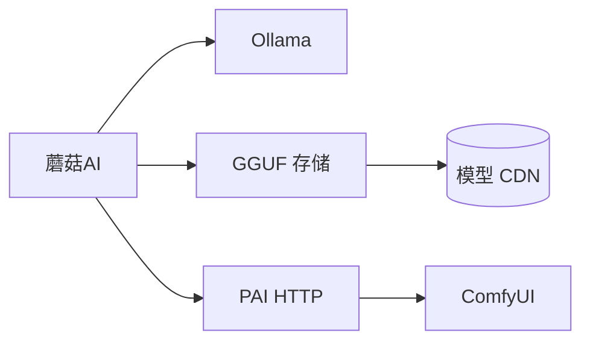

# 蘑菇AI · Mogu AI

[English](./README.md) | **简体中文**

<p align="center">
  <strong>本地模型一键下载 · 离线聊天 · 可选 ComfyUI 出片</strong><br/>
  <sub>Windows 桌面应用，无需命令行，数据留在本机。</sub>
</p>

[](https://github.com/ly136148277-netizen/mogu-ai-releases/releases/latest)
[](LICENSE)
[](https://github.com/ly136148277-netizen/MoguAI)
[](./README.md#给开发者)

---

## 蘑菇AI 是什么？

**蘑菇AI** 是一款免费开源的本地 AI 桌面工具，把「找模型、下载、导入、聊天、出片」收进一个窗口里，不用在 HuggingFace、终端和多个网页之间来回跳。

| 你想… | 蘑菇AI 帮你… |
|--------|-------------|
| 试 Llama、Qwen、Phi 等 | **模型仓库** 里浏览、一键下载 GGUF |
| 不用云端 API 聊天 | 内置 **Ollama 聊天**，多会话、Markdown、导出 |
| 不想手写 Modelfile | 下载完成后 **自动导入 Ollama** |
| 用 ComfyUI 出图/出片（可选） | **出片面板**：放 JSON → 刷新 → 跑预设 |

模型下载完成后，聊天可 **完全离线** 使用。

---

## 下载

👉 **[最新安装包](https://github.com/ly136148277-netizen/mogu-ai-releases/releases/latest)**

| 文件 | 说明 |
|------|------|
| `蘑菇AI Setup x.y.z.exe` | 安装版（推荐） |
| `蘑菇AI x.y.z.exe` | 便携版 |

**需要：** [Ollama](https://ollama.com/)（聊天）· [PAI](https://github.com/)（可选，管家 + ComfyUI）

---

## 三步开始聊天

```
安装 Ollama → 在蘑菇AI里下载模型 → 开始聊天
```

1. 安装并启动 **[Ollama](https://ollama.com/)**  
2. 打开 **模型仓库** → 选模型（如 Qwen 2.5 7B）→ **下载**  
3. 导入完成后进入 **AI 聊天** 即可对话  

全程不用命令行。

---

## ComfyUI 工作流 — JSON 放哪里？

> **详细说明：** [`docs/COMFYUI_WORKFLOWS.md`](./docs/COMFYUI_WORKFLOWS.md)

这是下载用户最常问的问题，简明版如下：

### 把下载的 `.json` 放进这两个位置之一

| 目录 | 什么时候用 |
|------|------------|
| **`{PAI根目录}/workflows/`** | **推荐** — 网上下载的工作流。例：`E:\projects\PAI\workflows\` |
| **`{ComfyUI}/ComfyUI/user/default/workflows/`** | 在 ComfyUI 里点 Save 保存的 |

然后在蘑菇AI：**ComfyUI 出片** → **刷新列表**（或管家输入「同步工作流」）。

设置好 PAI 根目录后，该页面会显示 **你本机的真实路径**。

### 会自动读取、提取 API 数据吗？

**会，已经做好**（研发部 v1.3+ 已交付）：

1. PAI **扫描** 上述文件夹里的 `.json`  
2. **解析** 工作流结构  
3. **对照** 本机 ComfyUI 节点做校验  
4. **生成** 可 API 调用的 prompt，并在面板显示 **可 API** / **待校验** / **仅手动**  

**首次使用：** **AI 执行管家** → **一键识别本机**（写入 ComfyUI 路径）→ 放入 JSON → **刷新列表**。

> **别搞混：** GGUF 模型库（`catalog/models.json`）和 ComfyUI 工作流（`/workflows/catalog`）是 **两套目录**，各管各的。

---

## 功能一览

**基础（人人可用）**

- 模型仓库：搜索、标签、收藏、CDN 在线更新  
- 下载：多线程、断点续传、SHA256、HF 镜像  
- 我的模型：重新导入、打开目录、删除  
- AI 聊天：流式、Markdown、模板、会话导出  
- 中英双语 · GitHub 自动更新  

**可选（PAI 管家）**

- 自然语言操控电脑，L1/L2/L3 安全等级  
- ComfyUI 连接、队列、进度、5 个已验收出片预设  
- 工作流目录自动同步 + API 提取  

**预置模型（8 个）：** Llama 3 8B · Qwen 2.5 7B/3B · Phi-3 Mini · Gemma 2 2B · DeepSeek R1 Distill 7B · Mistral 7B v0.3 · Nomic Embed v1.5

---

## 架构示意



| 模块 | 作用 |
|------|------|
| **聊天** | 本地 Ollama |
| **模型** | GGUF 下载 + CDN 目录 |
| **管家** | PAI → ComfyUI、文件操作等 |

文档：[`docs/RELEASE.md`](./docs/RELEASE.md) · [`docs/COMFYUI_WORKFLOWS.md`](./docs/COMFYUI_WORKFLOWS.md) · [`docs/BUTLER_SMOKE.md`](./docs/BUTLER_SMOKE.md)

---

## 给开发者

```bash
git clone https://github.com/ly136148277-netizen/MoguAI.git
cd MoguAI
npm install
npm start
```

```bash
npm test      # 50 项测试
npm run dist  # 打包 Windows 安装程序
```

关联仓库：

| 仓库 | 用途 |
|------|------|
| [MoguAI](https://github.com/ly136148277-netizen/MoguAI) | 源码（本仓库） |
| [mogu-ai-releases](https://github.com/ly136148277-netizen/mogu-ai-releases) | 安装包 |
| [mogu-map](https://github.com/ly136148277-netizen/mogu-map) | GGUF 模型 CDN |

贡献指南：[CONTRIBUTING.md](./CONTRIBUTING.md) · 反馈：[Issues](https://github.com/ly136148277-netizen/MoguAI/issues)

---

## 许可证

[MIT](./LICENSE) — 可自由用于个人与商业项目。

---

<p align="center">
  如果蘑菇AI帮到了你，欢迎 ⭐ Star，能让更多同好发现这个项目。谢谢！
</p>
