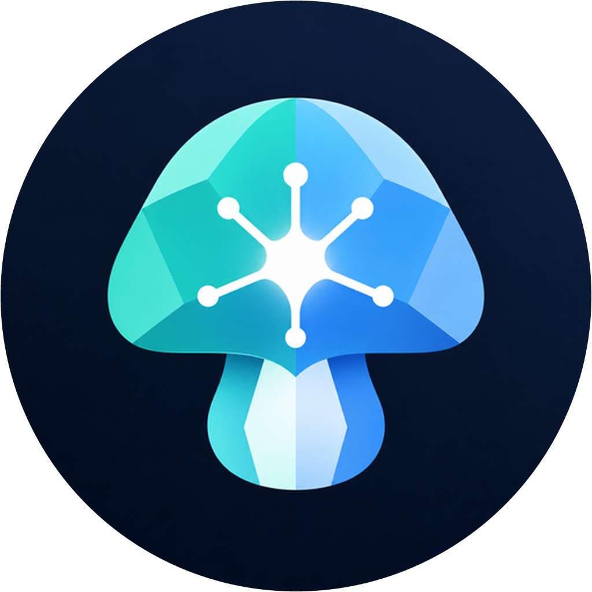
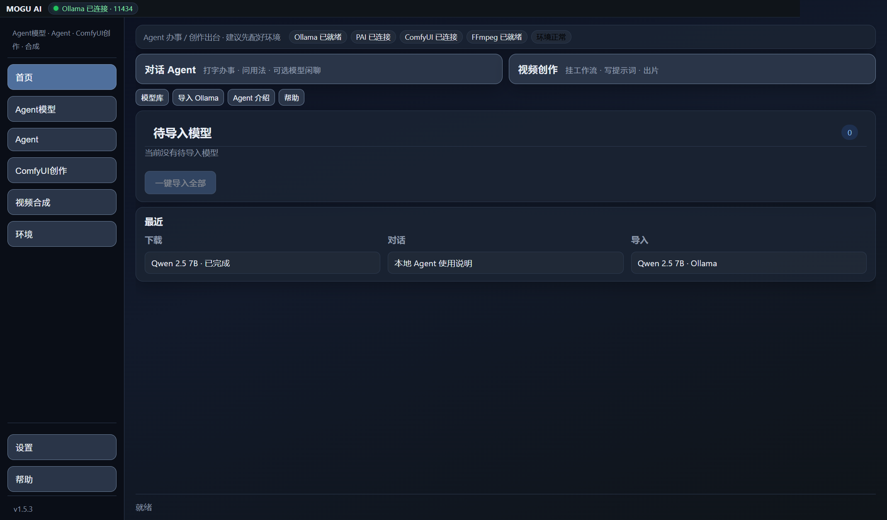
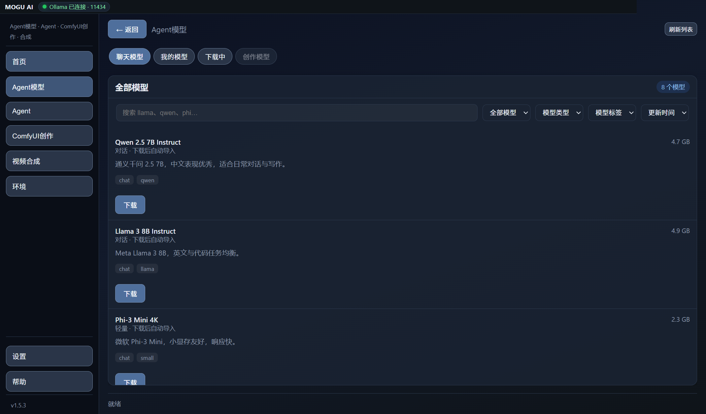
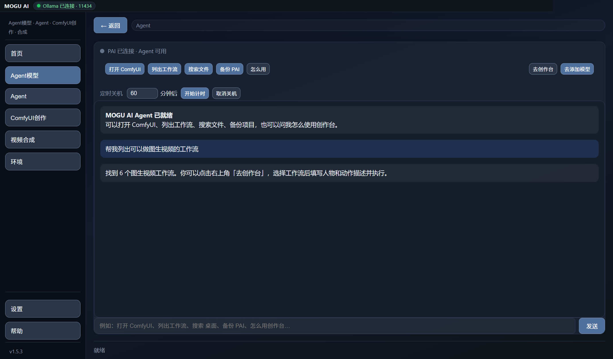
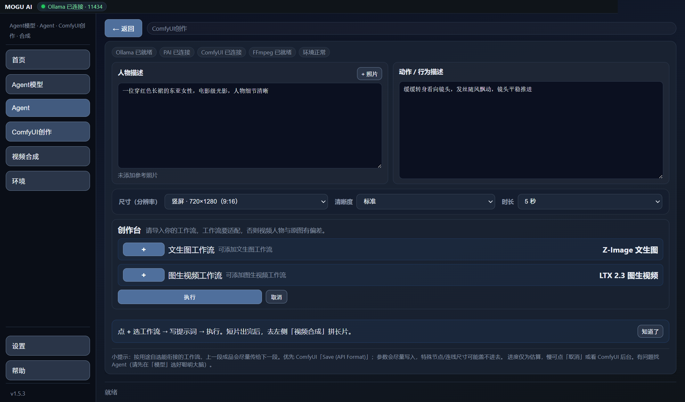
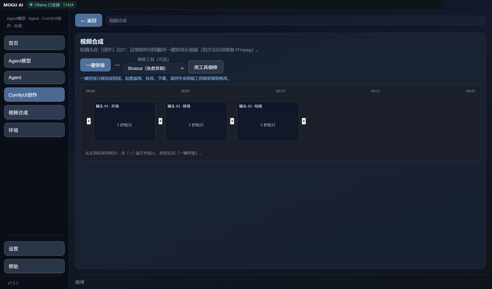
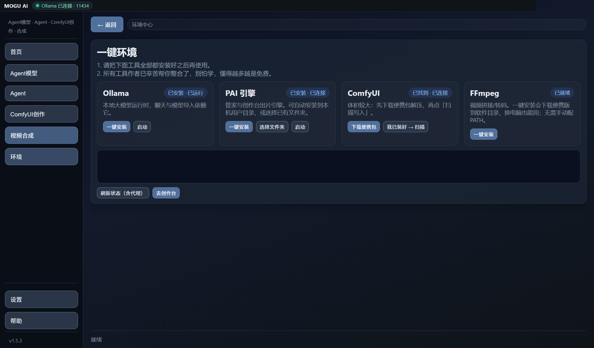

# MOGU AI 2.0

[English](./README.md) | **简体中文**

<p align="center">
  
</p>

<p align="center">
  <strong>个人 AI 控制中心 · Agent · 创作台 · 精密工厂</strong><br>
  <sub>面向 Windows 的开源本地 AI 桌面应用。模型、对话与作品留在自己的电脑。</sub>
</p>

<p align="center">
  <a href="https://github.com/ly136148277-netizen/mogu-ai-releases/releases/latest"><strong>下载最新版</strong></a>
  ·
  <a href="./docs/PUBLIC_RELEASE_FINAL_FREEZE.md">公共 RC 计划</a>
  ·
  <a href="./docs/MOGU_NORTH_STAR_AND_CAPABILITY_FUSION.md">北极星总纲</a>
  ·
  <a href="https://github.com/ly136148277-netizen/MoguAI/issues">反馈问题</a>
</p>

[](https://github.com/ly136148277-netizen/mogu-ai-releases/releases/latest)
[](LICENSE)
[](https://github.com/ly136148277-netizen/MoguAI)
[](./package.json)

> **当前候选版本：** `package.json` = **2.0.1-rc.1**。GitHub 公共证据确认 `v2.0.0` 已于 2026-07-18 发布。
> 研究轨 / SWE-bench / EPB 为内部 Default-Off，**不进入** Public Release 营销。

---

## MOGU AI 是什么

MOGU AI 是 Windows 个人 AI 控制中心：对话优先的 Agent、OpenClaw/PAI 运行时、九技能、ComfyUI 创作台、模型下载、权限与任务、备份/诊断，以及精密工厂编程能力。联网模型可选；本机工具留在本机。

<p align="center">
  
</p>

---

## 当前版本包含什么

### Agent 与执行方

- 对话首页；执行方显式选择：大脑 / OpenClaw / PAI
- 默认不静默降级；仅用户开启「OpenClaw 失败回退 PAI」才允许回退
- L1/L2/L3 权限与审计；L3 始终再确认
- 任务中心、备份/恢复（不含 secrets）、诊断导出

### Agent 模型

- 浏览、搜索并下载 GGUF 模型
- 下载完成后导入 Ollama，在本机离线使用
- 管理已下载模型和下载任务
- Agent 引导模型可选内置教程、本机 Ollama 或联网 API
- 预置 DeepSeek / OpenAI / 通义 / Kimi / 自定义 OpenAI 兼容端点

<p align="center">
  
</p>

### 本机 Agent

- 自然语言打开 ComfyUI、列工作流、搜文件、备份项目
- 询问环境安装或创作台用法
- PAI 权限分级与危险操作确认
- 长时间出片可预约关机

<p align="center">
  
</p>

### ComfyUI 创作台

- 导入自有文生图 / 图生视频工作流
- 人物描述与动作描述分开填写
- 选择分辨率、质量与视频时长
- 将参数写入兼容的 ComfyUI API 工作流
- 文生图结果可接到图生视频
- 进度预览、中断任务、清理队列

请优先在 ComfyUI 使用 **Save (API Format)**。工作流需匹配任务与模型；冷门节点可能无法自动改参。

<p align="center">
  
</p>

### 视频合成

- 时间线排列镜头
- FFmpeg 首尾相接拼接
- 首次可自动准备便携 FFmpeg
- 预览合成结果
- 可外开 Shotcut / 剪映 / 自定义工具继续剪辑

<p align="center">
  
</p>

### 一键环境

- 选择 AI 执行方（OpenClaw / PAI / 大脑）
- 检测并启动 Ollama
- 安装、选择并连接 PAI
- 扫描已有 ComfyUI
- 一键安装便携 FFmpeg（无需手配 PATH）

<p align="center">
  
</p>

---

## 下载与安装

普通用户应只从 [mogu-ai-releases](https://github.com/ly136148277-netizen/mogu-ai-releases/releases/latest) 安装通过硬门的公共包。此前本地 `dist` 产物仅为 **Internal Preview / 未签名**，不得称 Public Release。

典型文件名（版本跟随 `package.json`）：

- 安装包：`MOGU-AI-Setup-<version>.exe`（NSIS）
- Portable：electron-builder 便携 EXE（**免安装版**——与安装版共用 AppData；**不是** EXE 旁自包含用户数据）

1. 从 Releases 下载
2. 运行安装包或免安装 EXE
3. 首次启动打开「环境」，选择执行方，再按需配置 Ollama / PAI / ComfyUI / FFmpeg

### 数据与隐私

- 用户数据位于 `%APPDATA%\ai-model-manager\`（NSIS 与 Portable 相同）
- 卸载**默认保留** AppData（`deleteAppDataOnUninstall: false`）
- API Key 仅经 Electron `safeStorage` 存储（失败则拒绝明文保存）
- 干净 Profile 验收：`MOGU_USER_DATA=<空目录>` 或 `--user-data-dir=`——**禁止**删除开发者 Profile

### 系统要求

- Windows 10 / 11，64 位
- 应用约 300 MB
- 本机模型另需数 GB
- 本地模型与聊天需 [Ollama](https://ollama.com/)
- 创作需 PAI 与 ComfyUI
- 视频合成需 FFmpeg（可在应用内安装）

---

## ComfyUI 工作流

工作流 JSON 可放在：

- 推荐：`{PAI root}/workflows/`
- ComfyUI 默认：`{ComfyUI}/ComfyUI/user/default/workflows/`

然后在创作台选择工作流并填写参数。GGUF Agent 模型库与 ComfyUI 工作流目录是分开的。

详见 [`docs/COMFYUI_WORKFLOWS.md`](./docs/COMFYUI_WORKFLOWS.md) 与 [`docs/STUDIO_v1.5.md`](./docs/STUDIO_v1.5.md)。

---

## 开发

```bash
git clone https://github.com/ly136148277-netizen/MoguAI.git
cd MoguAI
npm ci
npm test
npm start
```

发版说明：[`docs/RELEASE.md`](./docs/RELEASE.md) · 代码签名政策：[`docs/CODE_SIGNING_POLICY.md`](./docs/CODE_SIGNING_POLICY.md) · 公共 RC：[`docs/PUBLIC_RELEASE_FINAL_FREEZE.md`](./docs/PUBLIC_RELEASE_FINAL_FREEZE.md)

---

## 许可证

MIT — 见 [LICENSE](./LICENSE)。
