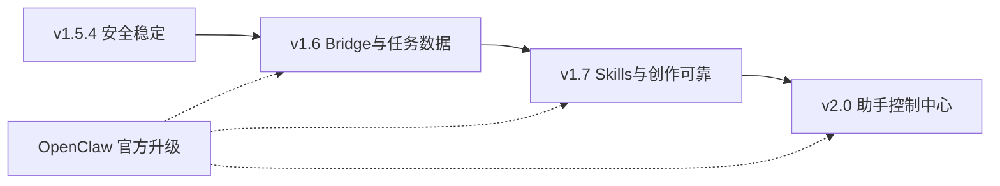

# MOGU AI 方案进程：到 v2.0

> 存档日期：2026-07-19  
> 产品定位：**通用个人 AI 助手的桌面控制中心**  
> 「本机」是能力（可控电脑、隐私、接本地模型），不是产品边界。

---

## 一、一句话目标

**不必从零改写去超越 OpenClaw（小龙虾）。**  
用 OpenClaw 做可升级的 Agent Runtime；用 MOGU 做中文桌面体验、权限、任务、资产与创作 Skills。  
到 v2.0：别人电脑上也敢安装、敢长期使用，并且「对话办事 + 创作工作流」在同一产品里闭环。

---

## 二、不做清单（全程有效）

| 禁止 | 原因 |
|------|------|
| 整包复制 OpenClaw 进仓库自己维护分叉 | 升级、安全、进程管理全变成自有负担 |
| Electron 内硬嵌完整 Gateway 当进程内核 | 与「受控、可升级 Runtime」冲突 |
| 继续横向堆功能（应用商店、评分、多平台）而欠安全债 | 当前最值钱的是「把工具链管住」 |
| 砍掉 ComfyUI / PAI / Ollama | 它们应变成高质量 Skills，不是被删除 |
| 用「本地创作控制台」当对外唯一 slogan | 过窄，不符合通用助手目标 |

---

## 三、目标架构

```text
MOGU 桌面端（品牌 · 体验 · 权限 · 资产）
├─ 对话工作台 / 任务中心 / 记忆视图 / 技能管理 / 设置
├─ OpenClaw Bridge（连接 · 启停 · 版本钉扎 · 健康检查）
│     └── OpenClaw Gateway（渠道 · Skills · 子 Agent · 定时 · 浏览器 · 模型路由 · 沙箱）
└─ MOGU Skills（先本地，后可扩展）
   ├─ 电脑控制
   ├─ ComfyUI 创作
   ├─ PAI 工作流
   ├─ Ollama / 模型管理
   └─ 文件 · 视频合成 · 备份恢复
```

**分工原则**

| 层 | 负责 |
|----|------|
| OpenClaw | Agent 基础设施：会话、Skills、渠道、定时、浏览器、路由 |
| MOGU | 安装配置、可视化、权限确认、任务中心、创作资产、备份诊断 |
| PAI（过渡期） | 现有本机执行与 ComfyUI 桥；逐步 Skill 化，不再当「唯一 Agent 内核」 |

---

## 四、版本总览

| 版本 | 周期（建议） | 主题 | 对用户的交付物 |
|------|--------------|------|----------------|
| **v1.5.4** | ✅ 已 yank | 稳定与安全热修（安装包已下架） | 见 v1.5.5 |
| **v1.5.5** | ✅ 基线 | 打包白名单 + ASAR denylist | 干净安装包；发版凭据不进仓库 |
| **v1.6.0** | ✅ 已切割 | OpenClaw Bridge + 任务/数据中心 | 能连上小龙虾；统一任务与数据视图 |
| **v1.7.0** | ✅ 已切割 | Skills 化 + 创作可靠 | PAI/ComfyUI 成标准 Skills；创作预检与恢复 |
| **v2.0.0** | 再 4–8 周 | 通用助手控制中心 | 对话为主入口；渠道/技能/权限产品化；创作是能力不是全部身份 |

旧路线图中「V2.0 = Ollama 自动启动」作废；**本文件定义的 v2.0 为上述产品形态。**

---

## 五、v1.5.4 — 稳定与安全（必做债）

**目标：** 不引入 OpenClaw 也能先让现有 1.5.3 更敢给别人装。

### 5.1 任务不误杀

- [x] PAI / Studio 提交时保存本端 `prompt_id`（或等价追踪 ID）
- [x] `studio:cancel` **绑定当前 runId/promptId**，禁止猜测其他任务；无 ID 必须确认后才全局取消
- [x] 运行中任务：仅当 ComfyUI ≥ 0.3.56 时定向 `/interrupt`；旧版运行项需全局确认（排队项仍可 `delete`）
- [x] 无法精确定位时：明确二次确认文案（「将影响 ComfyUI 上其他任务」）

### 5.2 密钥与设置

- [x] API Key 迁出明文 `settings.json` → Electron `safeStorage`（不可用则失败关闭，禁止明文降级）
- [x] `settings:get` 对渲染层只返回「已配置 / 未配置」与脱敏展示
- [x] `settings.json` 增加 `schemaVersion` + 原子写入（studio-pipeline / catalog 可后续对齐）

### 5.3 Electron 与本地桥硬化

- [ ] `sandbox: true`（在兼容前提下）
- [ ] 导航拦截 / `setWindowOpenHandler` / IPC 来源校验
- [x] `requestSingleInstanceLock` 单实例
- [x] `mogu-media` / `studio:media-url`：**白名单根目录**（PAI/ComfyUI/MOGU 输出等）+ 扩展名 + 大小上限

### 5.4 发布与文档卫生

- [x] 去掉 `package.json` 中 `example.com` 占位 publish URL
- [x] `SECURITY.md` / ROADMAP 版本对齐 **1.5.x**（验收脚本命名可随发版再改）
- [ ] 固定流程：干净分支 → `npm test` → `npm run dist` → 校验 asar/版本 → 再发 Release（解决「源码与安装版易分叉」）
- [ ] （可选）文件版本资源写入应用版本；签名证书另立项

### 5.5 运维体验

- [ ] 日志轮转
- [ ] 「导出诊断包」（设置、环境灯、日志摘要、无密钥）

**退出标准：** 取消不再默杀他人任务；密钥不进明文；媒体协议不可读任意盘；发版清单可复现。

---

## 六、v1.6.0 — OpenClaw Bridge + 任务/数据中心

**目标：** MOGU 能**连接并管理**本地 OpenClaw，同时有统一任务与数据视图。PAI 仍可跑，但不再是唯一对话内核。

### 6.1 OpenClaw Bridge（MVP）

契约全文见 [`OPENCLAW_BRIDGE.md`](./OPENCLAW_BRIDGE.md)（**不得**缩成仅 `status` / `send`）。

**alpha.1 / alpha.2 已完成** — 只连「用户已安装并运行的 Gateway」，不做自动安装。

- [x] 本机 Gateway 探测与健康状态（`openclaw:probe`）
- [x] WebSocket 握手、认证、版本/能力探测（`hello-ok`）
- [x] Gateway token 仅主进程 `safeStorage`；渲染层只见连接状态
- [x] 断线、超时、重连
- [x] OpenClaw 不可用可降级 PAI；**Gateway 已接受后等待超时禁止自动重发**
- [x] 统一任务模型入库（`TaskStore`）+ 精确取消（无 ID → needsConfirmation）
- [x] **alpha.2** `hello-ok.features.methods` 适配层（不硬编码 send 方法名）
- [x] **alpha.2** `openclaw:session-create` / `send` / `abort` + 流式事件 + TaskStore 终态
- [x] **alpha.2** Agent 双轨（OpenClaw / PAI）+ 对话内最小任务卡片
- [x] **alpha.2** Mock Gateway 契约测试

### 6.2 alpha.3 执行切片（开发版，不做稳定用户安装包）

**下一刀编码：`alpha.3-01` 统一任务契约与 IPC**（任务中心 / 权限确认 / 数据中心的共同依赖）。

| 切片 | 范围 | 验收要点 |
|------|------|----------|
| **alpha.3-01** ✅ | TaskStore schema v2 可迁移；统一 OpenClaw / PAI / Studio / ComfyUI 字段；`tasks:list/get/cancel/retry` IPC + preload；重启恢复、事件幂等、分页与状态查询 | 断线、重启、重复事件不产生重复任务或错误终态 |
| **alpha.3-02** ✅ | PermissionProxy 接入真实确认 UI；固定 L1/L2/L3；离线/超时/无 UI → 拒绝高风险；审计 + Gateway approval 双重校验 | L3 无法绕过 MOGU 确认 |
| **alpha.3-03** ✅ | 完整任务中心页：来源/状态筛选；IDs、日志、输出路径；实时更新、精确取消、重试、终态详情 | 四源任务统一可见可操作 |
| **alpha.3-04** ✅ | 数据中心只读：扫描可配置目录；占用/最近文件；导出诊断包（排除 token/key/大模型）；清理 dry-run + 二次确认 | 无可导出密钥、默认可审 |
| **alpha.3-05** ✅ | OpenClaw 生命周期与设置：状态分类、地址/启用/降级/token、官方引导（钉扎 protocol 4）、外部 CLI 启停与健康检查 | **不 fork、不内嵌 Gateway** |

**alpha.3 发布门（须同时通过后再打开发 tag）：**

```text
npm test
+ Bridge / Mock Gateway 契约测试
+ 任务中心关键 UI 测试
+ 断线恢复与精确取消测试
+ token / 日志 / 媒体路径安全检查
+ npm run preflight:release
+ 文档、版本号、ASAR 内容一致性
→ 仅发布 v1.6.0-alpha.3 开发 tag（不制作稳定用户安装包）
```

### 6.3 对话工作台（双轨过渡）

- [x] Agent 页支持模式：`PAI（兼容）` | `OpenClaw（主推）`（alpha.2）
- [x] OpenClaw 模式下：消息进 Gateway；对话内最小任务卡片（流式/取消/错误）（alpha.2）
- [x] **授权归属：** 高风险操作统一走主进程 PermissionProxy；离线 / 超时 / 无 UI → 拒绝；L3 不可绕过；审计 + Gateway 双闸（alpha.3-02）

### 6.4 任务中心 / 数据中心 / Bridge 设置

- [x] 统一列表与操作（alpha.3-01 + alpha.3-03）
- [x] ID 模型：`moguTaskId` + Gateway `sessionKey`/`sessionId`/`runId`/`taskId` + Comfy `prompt_id`
- [x] 数据中心只读扫描与诊断导出（alpha.3-04）
- [x] Gateway 生命周期与设置页（alpha.3-05）

### 6.5 信息架构（轻重组，不大翻）

导航已收敛为：

```text
首页 · 对话 · 任务 · 创作 · 模型 · 环境与数据 · 设置
```

- [x] 「Agent模型 / Agent」合并认知到 **对话 + 模型**
- [x] 「视频合成」挂在 **创作** 子流程，不抢主入口
- [x] 「环境 / 数据」合并为 **环境与数据**；OpenClaw 生命周期挂在 **设置** 子页签

**退出标准（v1.6.0）：** 统一任务契约稳定；任务中心可见四源任务；L3 必经确认；数据中心可导出无密钥诊断包；Gateway 状态与设置完整（仍不内嵌）；§6.5 IA 落地；`soak:beta` + `preflight:release` 通过。

---

## 七、v1.7.0 — Skills 化与创作可靠性

**目标：** ComfyUI / PAI / Ollama / FFmpeg 变成 **MOGU Skills**（对 OpenClaw 表现为标准 Skills 或 Bridge 工具），创作链路可预检、可恢复。

### 7.1 Skills 包装

`SKILL.md` 只教 Agent「何时/如何用工具」，**不等于**受控执行能力。每个 `mogu.*` 必须四件套交付（见 [`OPENCLAW_BRIDGE.md`](./OPENCLAW_BRIDGE.md) §5）：

```text
Skill 说明（SKILL.md）
+ 实际工具实现（Bridge Plugin / MCP / 本地服务）
+ 权限声明与确认策略
+ 任务 ID、日志、输出契约
```

交付顺序建议：`mogu.comfy → mogu.studio → mogu.ollama → mogu.pc → mogu.media`。每个 Skill 须具备预检、精确取消、失败重试与 provenance。

| 名称 | 能力 | 验收（四件套齐全） |
|------|------|-------------------|
| `mogu.comfy` | 列工作流、提交/取消、进度 | 绑定 `prompt_id` / 任务中心；精确取消 |
| `mogu.studio` | 创作台参数化出片 | 与 Studio UI 同步 + 输出契约 |
| `mogu.ollama` | 模型列表、导入、聊天路由 | 与模型页一致 |
| `mogu.pc` | 打开应用、搜文件、备份 | 可调用 + L2/L3 权限代理 + 任务/日志 |
| `mogu.media` | 拼接、打开外部剪辑 | 路径白名单 + FFmpeg 等实现 |

- [x] 禁止只交 `SKILL.md` 而无实现/权限/任务契约（`SkillRuntime` + handlers）
- [x] Skill 清单与权限级别写入文档（[`SKILLS_v1.7.md`](./SKILLS_v1.7.md)）
- [x] 技能管理页：启用/禁用、说明、所需环境灯

### 7.2 创作台可靠性

- [x] 工作流预检：缺模型、缺节点、ComfyUI 离线、路径错误（`mogu.studio` preflight）
- [x] 失败重试、断点恢复（至少「同参数再跑」）（`retry` + TaskStore replay）
- [x] 输出 provenance：模型 / 工作流 / 参数 / 耗时 / 任务 ID
- [ ] （可选）批量生成队列

### 7.3 测试与质量

- [x] Skills Runtime 契约测试（`tests/skills-runtime.test.js`）
- [x] 技能页 UI + 权限确认复用现有 PermissionProxy
- [x] 验收脚本 `acceptance_v1.7` / `soak:v1.7`

**退出标准：** 不打开「旧管家页」也能用 Skills 完成：打开 ComfyUI → 出片 → 拼视频；失败有预检而非黑盒超时。

---

## 八、v2.0.0 — 通用个人 AI 助手控制中心

**目标：** 对外身份是「个人 AI 助手桌面中心」；创作、模型、本机控制都是能力模块。

### 8.1 产品主路径

- [x] **对话** 为默认首页主入口（办事 / 问答 / 引导）
- [x] OpenClaw 为默认 Agent Runtime；PAI 直连降为兼容/高级
- [x] 渠道（Telegram 等）通过 OpenClaw 配置，MOGU 提供引导与状态，不自研全套协议
- [x] 技能市场：**先管本地 Skills + 官方/白名单安装**，不做大而全应用商店

### 8.2 体验与信任

- [x] 权限中心：按 Skill / 工具授权，可撤销
- [x] 会话 / 工作区隔离（依赖 OpenClaw，MOGU 可视化）
- [x] 备份 / 恢复 / 诊断包产品化
- [ ] （可选）代码签名、自动更新链路清洁（无占位 URL）

### 8.3 v2.0 明确不做

- 多平台原生客户端（先把 Windows 做透）
- 评分评论社区
- ModelScope 大而全分发（可后置插件）
- 自研第二套 Agent Runtime 与 OpenClaw 并行抢活

**退出标准：**

1. 新用户：安装 MOGU → 环境灯 → 接通 OpenClaw → 对话办事成功  
2. 创作者：同一产品内完成模型 / 出片 / 合成，且任务可追踪可取消  
3. 发布：可复现构建 + 文档与版本一致 + 安全基线（密钥、媒体、取消）达标  

---

## 九、里程碑与依赖



| 依赖 | 说明 |
|------|------|
| OpenClaw 版本钉扎 | Bridge 声明兼容版本区间；升级走引导，不静默大版本 |
| PAI | v1.6–1.7 期间仍是执行与 Comfy 桥；v2.0 后以 Skill 形态存在 |
| 签名证书 | 不阻塞功能版本；单独并行 |

---

## 十、成功度量（到 v2.0）

| 指标 | 目标 |
|------|------|
| 误杀他人 ComfyUI 任务 | 默认路径为 0（无确认则不全局清队列） |
| 密钥落盘 | 无明文 API Key 于 `settings.json` |
| Bridge | 一键检测 + 启停 + 对话往返成功率（本机冒烟） |
| 发版 | 源码 tag、安装包、asar 版本号一致可核对 |
| 文档 | SECURITY / ROADMAP / README 版本与能力描述一致 |

---

## 十一、近期执行顺序（给开发用）

1. **v1.5.5** 稳定用户基线（勿覆盖）  
2. **v1.6.0-alpha.1 / alpha.2** 已保存开发 tag（Bridge + 流式 Run + 双轨对话）  
3. **alpha.3-01…05 已落地**（tag `v1.6.0-alpha.3`）  
4. **`v1.6.0` 已切割** — Bridge / 任务 / 权限 / 数据中心 / §6.5 IA / 连接自动拉起与安装引导；客户切换需另宣布（此前基线仍为 `v1.5.5`）  
5. **`v1.7.0` 已切割** — `SkillRuntime` + 五 Skills 四件套 + 创作预检/provenance + 技能管理页  
6. **`v2.0.0` 已切割** — 对话默认首页；OpenClaw 默认 Runtime；权限中心可撤；会话列表可视；备份恢复无密钥；渠道引导；Skills 白名单安装  

```text
v1.5.5 → v1.6.0 ✅ → v1.7.0 ✅ → v2.0.0 ✅
```

---

## 十二、相关文档

| 文档 | 用途 |
|------|------|
| [README.zh-CN.md](../README.zh-CN.md) | 对外产品说明（随版本改） |
| [SETUP_HUB_v1.5.md](./SETUP_HUB_v1.5.md) | 环境中心 |
| [STUDIO_v1.5.md](./STUDIO_v1.5.md) | 创作台 |
| [COMFYUI_WORKFLOWS.md](./COMFYUI_WORKFLOWS.md) | 工作流 FAQ |
| [RELEASE.md](./RELEASE.md) | 发版 |
| [MOGU_AI_桌面端存档.md](../MOGU_AI_桌面端存档.md) | Agent 交接存档（需同步本方案结论） |
| [OPENCLAW_BRIDGE.md](./OPENCLAW_BRIDGE.md) | **Bridge / 权限 / Skill 四件套契约**（v1.6 事实来源） |

---

*本方案替代旧 ROADMAP 中「V2.0 = Ollama 自动启动进行中」的表述；历史 V1.0–V1.5.3 已交付内容仍以 CHANGELOG / 桌面端存档为准。*
